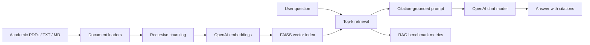

# 基于大语言模型的知识助手

一个面向学术文档的 RAG（Retrieval-Augmented Generation）问答系统。项目覆盖文档解析、文本分块、OpenAI Embeddings、FAISS 向量检索、带引用追踪的原文据实回答，以及检索质量和生成忠实度评估。

## 功能特性

- 支持 PDF、Markdown、TXT 学术资料导入。
- 使用 LangChain 文档加载器和递归文本分块器构建可追踪 chunk。
- 使用 OpenAI Embeddings 生成向量，FAISS 本地持久化索引。
- 回答时强制基于检索片段生成，并输出 `[C1]`、`[C2]` 形式引用。
- 提供 RAG 基准评估：Recall@k、MRR、引用覆盖率、可选 LLM 忠实度评分。
- CLI 工作流完整：`ingest`、`ask`、`evaluate`。

## 架构



## 快速开始

### 1. 安装依赖

```bash
python -m venv .venv
source .venv/bin/activate  # Windows: .venv\Scripts\activate
pip install -e ".[dev]"
```

### 2. 配置 API Key

```bash
cp .env.example .env
```

然后设置：

```text
OPENAI_API_KEY=你的 OpenAI API Key
```

### 3. 构建向量库

```bash
python scripts/rag_cli.py ingest --input data/sample_docs --index storage/faiss
```

### 4. 提问

```bash
python scripts/rag_cli.py ask "RAG 系统如何降低幻觉？" --index storage/faiss
```

输出示例：

```text
答案：RAG 通过先检索相关原文片段，再要求模型仅依据这些片段回答，从而降低无依据生成的概率 [C1]。

引用：
[C1] data/sample_docs/rag_overview.md#chunk-0
```

### 5. 评估

```bash
python scripts/rag_cli.py evaluate --benchmark data/benchmarks/sample_qa.jsonl --index storage/faiss
```

## 配置

默认配置位于 [configs/default.yaml](configs/default.yaml)：

- `embedding_model`：OpenAI embedding 模型。
- `chat_model`：回答生成模型。
- `chunk_size` / `chunk_overlap`：文本分块参数。
- `top_k`：检索返回片段数。
- `faithfulness_judge`：是否使用 LLM 评估忠实度。

## 项目结构

```text
.
├── src/language_assistant/   # RAG 核心包
├── scripts/rag_cli.py        # 命令行入口
├── configs/default.yaml      # 默认配置
├── data/sample_docs/         # 示例学术资料
├── data/benchmarks/          # 示例 RAG 基准集
├── tests/                    # 离线单元测试
└── docs/                     # 设计与评估说明
```

## 技术栈

Python、LangChain、OpenAI API、FAISS、PyPDF、Typer、Rich。

## 参考

- OpenAI 官方 Embeddings 文档说明 embeddings 可把文本表示为向量，用于搜索、聚类、推荐等任务。
- OpenAI 官方文本生成文档建议通过 API 生成模型回答；本项目使用 LangChain 封装 OpenAI chat model。
